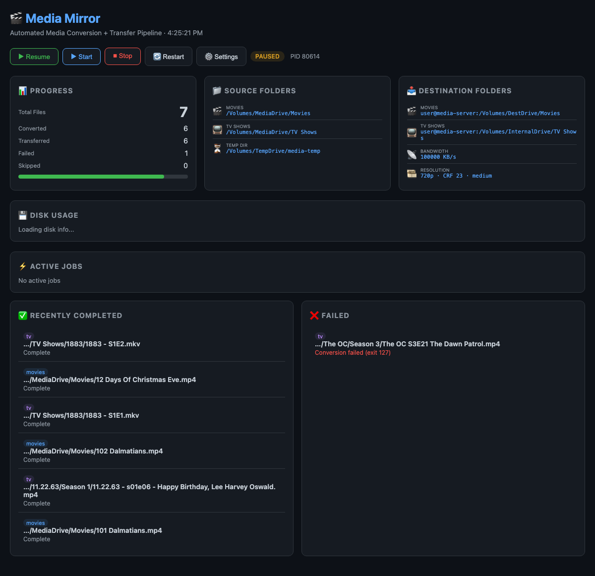

# 🎬 Media Mirror

**Automatically convert and mirror your media library to a second machine at a target resolution.**

Media Mirror watches a source media library (Movies + TV Shows), converts files to a lower resolution (e.g. 720p), and transfers them to a destination host over SSH — perpetually. New media added to the source is automatically picked up and mirrored.

Built for macOS. No external dependencies beyond `ffmpeg`, `rsync`, and `python3`.

---

## Features

- **Perpetual sync** — continuously watches for new media and processes it
- **Smart encoding** — skips re-encoding files already at or below the target resolution
- **Pre-flight size estimate** — projects the converted mirror's total size *before* encoding anything and tells you whether it fits the destination (per-file, from duration × target bitrate; copy-through files counted at real size)
- **Adaptive resolution** — when the destination drive runs low, automatically steps the encode resolution down a ladder (e.g. 720p → 480p → 360p) so the rest of the library still fits, instead of failing
- **Resumable transfers** — uses `rsync --partial` so interrupted transfers resume, not restart
- **Bandwidth limiting** — configurable transfer speed cap to avoid saturating your network
- **Web dashboard** — real-time progress, disk usage, projected size, source/destination paths, active jobs
- **Full control panel** — start/stop/restart the runner, pause/resume, edit all settings from the browser
- **Configurable** — resolution, quality (CRF), encoder preset, bandwidth, scan interval, adaptive ladder — all changeable live
- **Failure recovery** — failed jobs automatically retry on the next scan cycle
- **Read-only source** — source files are never modified; conversion happens in a temp directory

## Screenshot



## Requirements

- **macOS** (tested on macOS 12+; should work on Linux with minor adjustments)
- **ffmpeg** — for video conversion
- **rsync** — for file transfers
- **python3** — for the web dashboard (stdlib only, no pip packages)
- **SSH key auth** — to the destination host (the installer generates a key for you)

## Quick Start

```bash
# Clone
git clone https://github.com/YOUR_USER/media-mirror.git
cd media-mirror

# Install
chmod +x install.sh
./install.sh

# Edit config
nano /opt/media-mirror/config.env

# Add SSH key to destination (printed during install)
ssh user@dest-host 'cat >> ~/.ssh/authorized_keys' < /opt/media-mirror/dest_key.pub

# Open dashboard
open http://localhost:8080
```

## Configuration

All settings live in `/opt/media-mirror/config.env`. You can also edit them from the web dashboard (⚙️ Settings).

| Setting | Default | Description |
|---------|---------|-------------|
| `SOURCE_MOVIES` | — | Path to source Movies directory |
| `SOURCE_TV` | — | Path to source TV Shows directory |
| `TEMP_DIR` | — | Local temp directory for conversion output |
| `DEST_HOST` | — | SSH destination (`user@host`) |
| `DEST_MOVIES` | — | Remote path for converted Movies |
| `DEST_TV` | — | Remote path for converted TV Shows |
| `DEST_SSH_KEY` | `/opt/media-mirror/dest_key` | SSH private key for transfers |
| `TARGET_HEIGHT` | `720` | Target resolution height (720 = 720p) |
| `FFMPEG_CRF` | `23` | Quality factor (18 = best, 28 = smallest) |
| `FFMPEG_PRESET` | `medium` | Encoder speed/quality tradeoff |
| `ADAPTIVE_RESOLUTION` | `1` | Auto step resolution down when the destination fills (`0` to disable) |
| `RESOLUTION_LADDER` | `1080 720 480 360 240` | Heights to step down through (only rungs ≤ `TARGET_HEIGHT` are used) |
| `MIN_DEST_FREE_GB` | `20` | Step down a rung when destination free space drops below this |
| `RSYNC_BWLIMIT` | `100000` | Transfer bandwidth limit in KB/s |
| `SCAN_INTERVAL` | `3600` | Seconds between full library scans |
| `DASHBOARD_PORT` | `8080` | Web dashboard port |

## Estimating mirror size up front

Before kicking off a long run you can project how much space the converted
library will take on the destination — and whether it fits:

```bash
python3 estimate_size.py            # uses /opt/media-mirror/config.env
python3 estimate_size.py --target 480   # preview a different resolution
```

The runner also computes this automatically on startup (shown on the dashboard
as **Projected Mirror Size**), and the dashboard's **Re-estimate** button reruns
it on demand. Files already at/below the target are counted at their real size
(they're copied, not re-encoded); everything else is estimated from its duration
and the target bitrate.

## Adaptive resolution

If the destination drive fills before the mirror finishes, Media Mirror steps
the encode resolution **down** one rung on the ladder (e.g. 720p → 480p) so the
remaining files are smaller and still fit, rather than failing on "no space left
on device". The current effective resolution is shown on the dashboard, and a
downstep is also triggered if a transfer fails with an out-of-space error. The
source is never touched and already-transferred files are left as-is; only
not-yet-encoded files are affected.

## Web Dashboard

The dashboard runs on the conversion host and provides:

- **Progress overview** — total files, converted, transferred, failed, skipped
- **Active jobs** — real-time conversion progress (%, speed, ETA)
- **Source & destination paths** — at a glance
- **Disk usage** — local and remote (via SSH)
- **Controls** — Start / Stop / Restart / Pause / Resume
- **Settings panel** — edit all config parameters and apply with one click

Access it at `http://YOUR_HOST:8080`

## How It Works

1. **Scan** — Finds all media files (mp4, mkv, avi, m4v, mov, etc.) in source directories
2. **Check** — Skips files that already exist on the destination
3. **Analyze** — If source resolution ≤ target, copies without re-encoding
4. **Convert** — Encodes to H.264 + AAC in MP4 container via ffmpeg
5. **Transfer** — Sends converted file to destination via rsync (bandwidth-limited, resumable)
6. **Clean up** — Removes temp file after successful transfer
7. **Repeat** — Sleeps, then scans again for new content

## Troubleshooting

### "Operation not permitted" on macOS

macOS TCC (Transparency, Consent, and Control) can block background processes from accessing external volumes. Solutions:

1. **Use `@reboot` in crontab** instead of LaunchAgent (usually inherits user session permissions)
2. **Grant Full Disk Access** to `/bin/bash` in System Preferences → Privacy & Security
3. **Run manually** via `nohup bash /opt/media-mirror/media-mirror.sh &`

### ffmpeg not found

Ensure ffmpeg is in your PATH. The installer tries `/usr/local/bin` and `/opt/homebrew/bin`.

### Transfer failures

- Check SSH key auth: `ssh -i /opt/media-mirror/dest_key user@dest-host echo OK`
- Check destination disk space
- Review logs: `/opt/media-mirror/logs/transfer_*.log`

### Single-run mode

To process everything once without looping:

```bash
bash /opt/media-mirror/media-mirror.sh --once
```

## Uninstall

```bash
chmod +x uninstall.sh
./uninstall.sh
```

## License

MIT — see [LICENSE](LICENSE)
